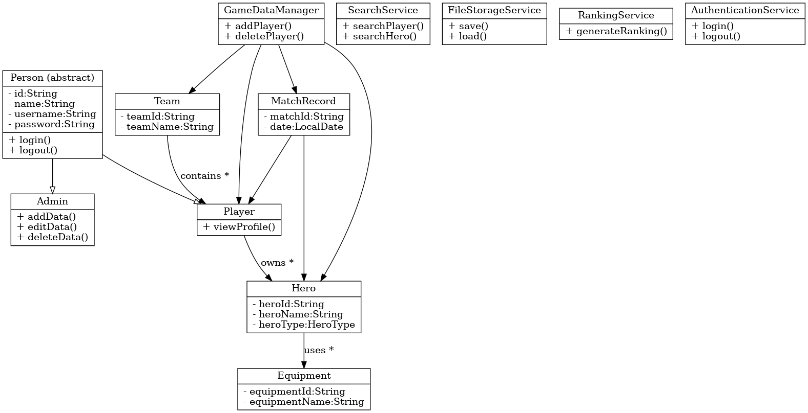

# Plan:AI-Assisted Information Management System for Honor of Kings

> Author:Wang Xinfu
> 
> Date:2026-6-4
> 

---
## 1.Project Goal

This system stores and manages information about heroes, equipment, teams, and match records.

The system supports two roles:
- Admin: can create, edit, and delete data
- Player: can view and search public information

---
## 2. Requirement Analysis


1. **Player Lookup**  
   Users can search for a player by ID and view player information.

2. **Team Overview**  
   Users can search for a team by ID and view team details and members.

3. **Hero Details**  
   Users can search for a hero by ID and view hero information and equipment.

4. **Equipment Ranking**  
   The system generates equipment rankings based on usage and rating.

5. **Match History**  
   Users can view match records for players and teams.

6. **Leaderboard**  
   The system generates player rankings based on win rate and level.

7. **Data Management**  
   Admins can add, edit, and delete system data.

8. **Authentication**  
   The system supports login for Admin and Player roles.


---
## 3. Java Concepts Used

### Inheritance
Person is an abstract superclass.
Player and Admin extend Person.

### Interface
Searchable:
Used by SearchService.

Persistable:
Used by FileStorageService.

Authenticatable:
Used by AuthenticationService for login verification.

### Polymorphism
All users can be stored in:

```java
List<Person> users;
```

The system can process Player and Admin objects through Person references.

### Encapsulation
All fields are private.

Getter and Setter methods are used to control access.

### Collections
ArrayList<Player> for team members.

ArrayList<Hero> for player heroes.

ArrayList<Equipment> for hero equipment.

HashMap<String, Player> for fast player lookup.

### Exception Handling
Handle:

- invalid menu input
- duplicate IDs
- player not found
- file loading failure

### File I/O
FileStorageService saves and loads:

- players
- heroes
- teams
- match records

using CSV files.

### Enums
HeroType:
TANK, MAGE, ASSASSIN, MARKSMAN, SUPPORT

Role:
ADMIN, PLAYER

MatchResult:
WIN, LOSS, DRAW

EquipmentType:
ATTACK, DEFENSE, MAGIC, MOVEMENT

---
## 4. Class Design

### Person (Abstract)
Base class for all system users.

Attributes:
- id
- name
- username
- password

### Player
Extends Person.

Responsibilities:
- manage hero collection
- view match history
- update personal profile

### Admin
Extends Person.

Responsibilities:
- manage system data
- add/edit/delete records

### Hero
Stores hero information.

Attributes:
- heroId
- heroName
- heroType
- attack
- defense
- equipmentList

### Equipment
Stores equipment information.

Attributes:
- equipmentId
- equipmentName
- equipmentType
- score

### Team
Stores team information.

Attributes:
- teamId
- teamName
- members

### MatchRecord
Stores match data.

Attributes:
- matchId
- date
- result
- players
- heroesUsed

### SearchService
Provides search functions.

### RankingService
Generates leaderboard and equipment rankings.

### AuthenticationService
Handles login and role verification.

### FileStorageService
Handles file persistence.

### GameDataManager
Central manager for all system data.

---
## 5. UML Draft



---
## 6. Data Design

### Initial Dataset

The system will contain:

- 3 Teams
- 10 Players
- 15 Heroes
- 20 Equipment items
- 10 Match Records

### Relationships

- Each Team contains multiple Players.
- Each Player owns multiple Heroes.
- Each Hero can use multiple Equipment items.
- Each MatchRecord contains participating Players and Heroes used.
---
## 7. AI Usage Plan
**Architect Agent**: Suggest class structure, interface names, UML relationships

**Implementation Agent**: Write code to modify, finish the class struct.

**Testing/Reviewer Agent**: Find bugs, suggest test cases, give me the suggestion.

All AI suggestions will be reviewed and verified before being used in the project.

---
## 8. Prompt Strategy
**Design prompts** — ask for suggestions only, never full code

**Implementation prompts** — always paste existing class context

**Debugging prompts** — describe the exact symptom

**Review prompts** — ask for specific checks


---
## 9. Development Timeline

- **step 1**    
Read requirements, create Git repository, write this **plan.md**.
- **step 2**    
Ask **Architect Agent** for class design feedback; revise structure and **plan.md**.
- **step 3**    
Write the basic classes and use **Implementation Agent** to modify it, revise **plan.md**.
- **step 4**    
Use **Implementation prompts** to finish classes one by one, and check by myself every time.
- **step 5**   
Use **Testing/Reviewer Agent** to find bugs and give me some suggestion and test cases, revise **plan.md**.
- **step 6**    
Compile and run frequently. 
- **step 7**    
Use test cases to test the system, and record what happened.
- **step 8**    
Finish **prompts.md**, **agent-log.md**, **reflection.md**, **git-history.txt**, **README.md**. 


---
## 10. Testing Plan

---
## 11. Risk Analysis

---
## 12. Final Reflection Placeholder

---
 